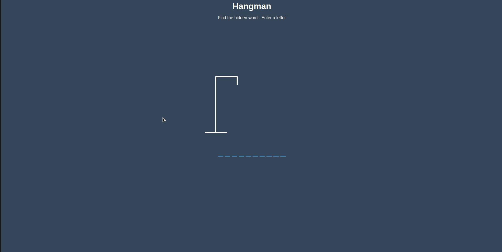
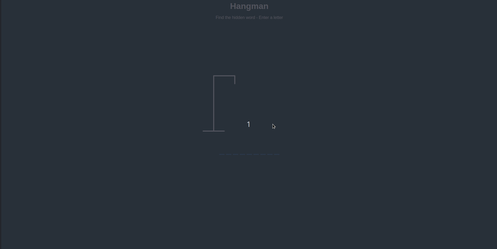

<h1 align="center">
 
Hangman
</h1>

Select a letter to figure out a hidden word in a set amount of chances

  

[//]: # (Add your gifs/images here:)

  
  

## Tools
[//]: # (Add the features of your project here:)
This app use all the latest tools and practices in web development!

- 🌳 **HTML** — Standard markup language for Web pages.
- 🎨 **CSS** —  A stylesheet language used to describe the presentation of a document written in HTML
- 👨‍💻 **JavaScript** — A lightweight, interpreted, or just-in-time compiled programming language with first-class functions 

## Project Specifications

- Display hangman pole and figure using SVG
- Generate a random word
- Display word in UI with correct letters
- Display wrong letters
- Show notification when select a letter twice
- Show popup on win or lose
- Play again button to reset game

## Getting started

1. Clone the project with `git@github.com:devcass/hangman.git`
2. Enter in the project with `cd hangman`
3. Click on the file to open on your favorite browser

## License

This project is licensed under the MIT License - see the [LICENSE](https://opensource.org/licenses/MIT) page for details.
